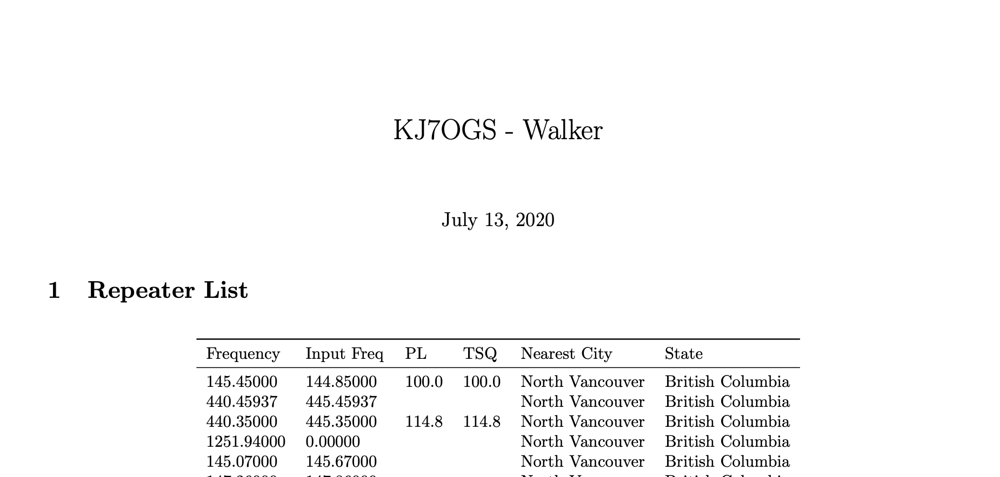

# Repeater HC (Hard copy)


Repeater HC is a project that aims to automatically query repeaters of interest
and put them in a printable form. In the future it will be in the format of a
small booklet to take backpacking and camping.

## Setup
Make sure you have python3 installed
```
pip install wget pandas
```

Install a latex distribution, you should have pdflatex.

## Running
Start by editing conf.py - there are some field that should be self explanatory.
Edit template.tex to your liking, in the future I plan to put band plans and
other goodies in here.
```
python3 main.py
```

A pdf should come out - that's it!

